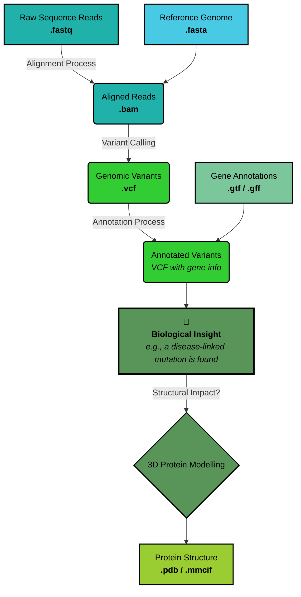

# From Raw Reads to Research Breakthroughs: The Complete Guide to Bioinformatics File Formats

> **TL;DR**: A comprehensive guide to the file formats that power modern biological research, from DNA sequencing to protein structures. Bookmark this as your go-to reference! 🧬

---

## Table of Contents
- [Introduction: The Language of Life](#introduction-the-language-of-life)
- [The Bioinformatics Journey](#the-bioinformatics-journey)
- [Complete File Formats Reference](#complete-file-formats-reference)
- [Quick Reference Cheat Sheet](#quick-reference-cheat-sheet)
- [Conclusion](#conclusion)

---

## Introduction: The Language of Life

G'day! In the world of bioinformatics, data is everything. But this data doesn't just appear as numbers on a screen—it speaks a variety of specialised languages in the form of file formats. From the raw output of a DNA sequencer to the intricate 3D model of a protein, each file format is a container carefully designed to tell a specific part of the biological story.

For newcomers, this alphabet soup of extensions—FASTA, BAM, VCF, PDB—can be fair dinkum intimidating. For seasoned researchers, it's the very grammar of their work. Understanding these formats is like learning the Rosetta Stone of genomics; it unlocks the ability to read the story of life itself.

This article will take you on a journey through a typical bioinformatics workflow, showing you not just *what* these files are, but *why* they matter and how they connect to transform a stream of raw data into a scientific breakthrough.

---

## The Bioinformatics Journey

Let's follow the path of biological data from sequencer to scientific discovery:



### 🚀 Step 1: Sequencing & Alignment

#### The Journey Begins - Raw Sequence Data
Every genomics project starts with sequencing. When a DNA or RNA sample comes off a modern sequencing machine, the data is captured in a **FASTQ** file. Think of this as the raw, unedited manuscript of the genome—it's an extension of the simpler **FASTA** format, which just stores the sequence of letters (A, T, C, G). But FASTQ adds a crucial second layer of information: a quality score for each and every base.

- **FASTA (.fasta, .fa):** The universal standard for a sequence of letters. Simple, clean, and readable.
- **FASTQ (.fastq, .fq):** The workhorse of modern sequencing. It contains the sequence *and* a quality score, telling you how confident the machine was about each letter it read.

Without FASTQ, we'd have the letters of our story, but no idea if they were spelled correctly!

#### Creating the Map - Aligning to a Reference
Having millions of short sequence reads is like having a book shredded into tiny strips of paper. To make sense of them, you need to piece them back together. In bioinformatics, we do this by aligning the reads to a known reference genome. The result is stored in alignment formats:

- **SAM (.sam):** The detailed text-based map of every alignment. Great for inspection, but too big for daily use.
- **BAM (.bam):** The compressed, indexed version of SAM. It's the industry standard because it's smaller and allows software to quickly access data from any genomic region.
- **CRAM (.cram):** An even more compressed format, perfect for long-term archiving.

### 🔍 Step 2: Variant Discovery & Annotation

#### Finding the Clues - Genetic Variants
Why sequence a genome in the first place? Often, it's to find the differences—the genetic variants that make an individual unique or might be linked to a disease. This critical information is stored in **VCF (Variant Call Format)** files.

- **VCF (.vcf):** The standard format for listing genetic variants. It's the key to finding the "smoking gun" mutation in a cancer sample.

#### Adding the Meaning - Genomic Annotation
Now we have our variants, but what do they mean? We need genomic annotations to understand if a variant falls inside a gene or disrupts a protein:

- **GFF/GTF (.gff, .gtf):** The blueprints of the genome, describing the location and structure of all known genes.
- **BED (.bed):** A simple format for marking specific "regions of interest" on the genome.

### 🏗️ Step 3: Interpretation & Follow-up

#### Visualising the Story - 3D Structures
Sometimes, we need to see how a genetic variant affects the protein structure in 3D:

- **PDB (.pdb):** The foundational format for 3D molecular structures.
- **mmCIF (.cif):** The modern, more robust standard that's replacing PDB.

---

**That's the main storyline of a typical genomics project—from raw reads all the way through to structural insights. Now, let's get into the nitty-gritty and explore the full cast of characters in our bioinformatics library!**

---

## Complete File Formats Reference

Right, let's get into the nitty-gritty! Here's your comprehensive reference guide to bioinformatics file formats, organised by category:

### 🧬 Sequence Data Formats

| Format | Extension(s) | Description |
|--------|--------------|-------------|
| **FASTA** | `.fasta`, `.fa`, `.fas`, `.fna`, `.faa` | A simple and ubiquitous text format for sequences. Each entry begins with a header marked by ">", followed by raw sequence data. Highly compatible with nearly all sequence analysis tools. |
| **FASTQ** | `.fastq`, `.fq` | The standard for raw data from next-generation sequencers. Extends FASTA by adding ASCII-encoded Phred quality scores for each base, critical for assessing sequencing accuracy. |
| **GenBank** | `.gb`, `.gbk` | A rich format from NCBI that integrates sequences with extensive annotations, metadata, feature tables describing genes and biological elements. |
| **EMBL** | `.embl` | The European Molecular Biology Laboratory's counterpart to GenBank. Used as the primary format for databases like the European Nucleotide Archive (ENA). |
| **Swiss-Prot** | `.dat` | A highly curated protein sequence format from UniProt, renowned for detailed annotations including protein function, post-translational modifications, and literature references. |

### 🎯 Alignment Formats

| Format | Extension(s) | Description |
|--------|--------------|-------------|
| **SAM** | `.sam` | Sequence Alignment/Map format - a human-readable, tab-delimited text file detailing how reads align to a reference. Comprehensive but verbose. |
| **BAM** | `.bam` | The **B**inary version of S**AM**. Compressed and significantly faster for software to process, making it the de facto standard for large sequencing projects. |
| **CRAM** | `.cram` | Highly compressed alignment format that stores only differences between reads and reference sequence. Ideal for long-term archival of large-scale genomic data. |
| **PSL** | `.psl` | BLAT alignment output format providing detailed 21-column alignment summary including coordinates, match/mismatch counts, and gap information. |
| **MAF** | `.maf` | **M**ultiple **A**lignment **F**ormat stores alignment blocks from multiple sequence alignments, particularly useful in comparative genomics. |
| **Clustal** | `.aln`, `.clustal` | Human-readable output from Clustal alignment programs, displaying aligned sequences in blocks with consensus symbols indicating conservation. |
| **PHYLIP** | `.phy` | Simple format used by phylogenetic analysis programs, containing multiple-aligned sequences in either interleaved or sequential format. |
| **NEXUS** | `.nex`, `.nexus` | Powerful, extensible format for phylogenetic analyses with block-based structure allowing sequence data, taxonomic info, and trees in one file. |

### 📍 Genomic Feature & Annotation Formats

| Format | Extension(s) | Description |
|--------|--------------|-------------|
| **GFF/GFF3** | `.gff`, `.gff3` | **G**eneral **F**eature **F**ormat - 9-column, tab-delimited file for genomic annotations. GFF3 allows complex relationships between features like gene-transcript hierarchies. |
| **GTF** | `.gtf` | **G**ene **T**ransfer **F**ormat - stricter variant of GFF2 for gene and transcript structures. Well-defined attributes make it reliable for RNA-Seq analysis. |
| **BED** | `.bed` | **B**rowser **E**xtensible **D**ata format for genomic regions. Requires only 3 columns (chromosome, start, end) but extensible to 12, perfect for browser visualisation. |
| **WIG** | `.wig` | **Wig**gle format for dense, continuous-valued data like sequencing coverage or conservation scores, displayed as graphs in genome browsers. |
| **BigWig** | `.bw`, `.bigwig` | Binary, indexed version of WIG format enabling efficient storage and rapid retrieval of data for specific genomic regions without reading entire files. |
| **BigBed** | `.bb`, `.bigbed` | Binary, indexed version of BED format optimised for fast, on-demand data retrieval of large genomic feature datasets. |

### 🧮 Variant Data Formats

| Format | Extension(s) | Description |
|--------|--------------|-------------|
| **VCF** | `.vcf` | **V**ariant **C**all **F**ormat - the standard for storing genetic variations, detailing location, alleles, quality metrics, and genotype information across samples. |
| **BCF** | `.bcf` | **B**inary version of V**CF** storing variant information in compressed format, much faster for computational analysis of large population datasets. |
| **PLINK (ped/map)** | `.ped`, `.map` | Classic format pair for genome-wide association studies (GWAS). .ped stores sample pedigree and genotypes, .map contains genetic marker information. |
| **PLINK (binary)** | `.bed`, `.bim`, `.fam` | Modern binary PLINK format splitting data into three efficient files: genotype calls (.bed), variant info (.bim), and sample/family info (.fam). |

### 🌳 Phylogenetic Tree Formats

| Format | Extension(s) | Description |
|--------|--------------|-------------|
| **Newick** | `.nwk`, `.tree` | Minimal, text-based standard representing tree structures using nested parentheses. Stores topology, branch lengths, and node labels in universally parsable format. |
| **NEXUS Trees** | `.tre` | NEXUS format for phylogenetic trees within TREES blocks, allowing trees with metadata, translation tables, and analysis parameters. |

### 🏗️ Macromolecular Structure Formats

| Format | Extension(s) | Description |
|--------|--------------|-------------|
| **PDB** | `.pdb` | Legacy **P**rotein **D**ata **B**ank format storing 3D atomic coordinates, sequence details, and experimental metadata in fixed-column text format. |
| **mmCIF** | `.cif` | **M**acro**m**olecular **C**rystallographic **I**nformation **F**ile - modern standard replacing PDB with key-value structure overcoming line-length limitations. |
| **PDBx/XML** | `.xml` | XML representation of mmCIF format providing highly structured, machine-readable macromolecular data easily parsed by modern software. |

### 🔬 Specialised Formats

| Category | Format | Extension(s) | Description |
|----------|--------|--------------|-------------|
| **Expression Data** | **GCT** | `.gct` | **G**ene **C**luster **T**ext format for gene expression matrices with metadata for genes (rows) and samples (columns). |
| | **GMT** | `.gmt` | **G**ene **M**atrix **T**ransposed format for gene sets - each row defines a set with name, description, and gene list for pathway analysis. |
| | **CLS** | `.cls` | Categorical class file format defining sample groups and phenotypes for expression analysis. |
| **Single-Cell & HDF5** | **HDF5** | `.h5`, `.hdf5` | **H**ierarchical **D**ata **F**ormat - general-purpose container for large, complex, heterogeneous data, foundation for many modern formats. |
| | **AnnData** | `.h5ad` | **Ann**otated **Data** format standard for single-cell genomics, storing data matrix with cell and gene annotations. |
| | **Loom** | `.loom` | HDF5-based format for large omics datasets with rich metadata, designed for streaming access to big data. |
| **Cheminformatics** | **SDF** | `.sdf` | **S**tructure-**D**ata **F**ile standard for chemical structures and associated data, essential for compound libraries. |
| | **SMILES** | `.smi` | **S**implified **M**olecular **I**nput **L**ine **E**ntry **S**ystem - text representation of chemical structure formulas. |
| **Image & Microscopy** | **TIFF** | `.tif`, `.tiff` | Tagged Image File Format for microscopy images, supports multiple channels and metadata. |
| | **OME-TIFF** | `.ome.tif` | Open Microscopy Environment TIFF with standardised metadata for biological imaging experiments. |
| | **CZI** | `.czi` | Zeiss microscopy format storing multi-dimensional images with comprehensive acquisition metadata. |
| **Other** | **RData** | `.RData`, `.rda` | R workspace format for storing R objects, commonly used in bioinformatics workflows and analysis pipelines. |

### 🗂️ Index Files (The Unsung Heroes)

| Format | Extension(s) | Description |
|--------|--------------|-------------|
| **BAI** | `.bai` | BAM index file enabling fast random access to specific genomic regions without reading entire BAM files. |
| **CSI** | `.csi` | Coordinate-sorted index for very large BAM/BCF files, supports longer chromosomes than BAI format. |
| **TBI** | `.tbi` | **T**a**b**ix **i**ndex for compressed tab-delimited files (VCF, GFF, BED), enabling rapid coordinate-based retrieval. |
| **FAI** | `.fai` | **FA**STA **i**ndex storing sequence names, lengths, and byte offsets for instant sequence fetching without parsing entire files. |

---

## Quick Reference Cheat Sheet

### 🎯 Most Common Workflow Files

```
Raw Data:     .fastq → .fasta
Alignment:    .sam → .bam → .cram
Variants:     .vcf → .bcf
Annotation:   .gff/.gtf, .bed
Structure:    .pdb → .mmcif
```

### 🔄 Binary vs Text Formats

| Text (Human Readable) | Binary (Compressed) | Use Case |
|----------------------|-------------------|----------|
| SAM | BAM | Alignment data |
| VCF | BCF | Variant data |
| WIG | BigWig | Coverage tracks |
| BED | BigBed | Genomic features |

### 🚀 Performance Tips

- **Use binary formats** (BAM, BCF, BigWig) for large datasets
- **Always index** your files (BAI, TBI, CSI) for random access
- **Compress text files** with bgzip for tabix indexing compatibility
- **Choose CRAM** for long-term storage of alignment data

---

## Conclusion: More Than Just Files

Bioinformatics file formats are more than just technical specifications—they're the scaffolding upon which modern biological discovery is built. They create a standardised language that allows a sequencer in one lab to produce data that can be analysed by a computer cluster on the other side of the world and ultimately visualised by a structural biologist years later.

Understanding this language is the first step toward unlocking the incredible stories hidden within our genomes. Whether you're just starting your bioinformatics journey or you're a seasoned researcher looking for a quick reference, bookmark this guide—it's your Rosetta Stone for the language of life! 🧬

---

### 📚 Additional Resources

- [NCBI File Format Documentation](https://www.ncbi.nlm.nih.gov/datasets/docs/v2/reference-docs/file-formats/)
- [Ensembl File Formats Guide](https://www.ensembl.org/info/website/upload/index.html)
- [UCSC Genome Browser Formats](https://genome.ucsc.edu/FAQ/FAQformat.html)
- [HTSlib Specifications](https://samtools.github.io/hts-specs/)

---

*Found this guide helpful? Give it a ⭐ and share it with your mates in the lab!*
