# From Association to Action: The Complete Guide to Post-GWAS Analysis & Fine-Mapping

> **TL;DR:** GWAS finds the neighborhoods where disease genes live. Post-GWAS analysis finds the actual culprits, understands how they cause trouble, and turns that knowledge into medical breakthroughs. This is your roadmap from statistical signals to biological mechanisms! 🧬🔍

## Table of Contents

- [Introduction: After the Manhunt](#introduction-after-the-manhunt)
- [The Post-GWAS Journey: From Signal to Solution](#the-post-gwas-journey-from-signal-to-solution)
- [Stage 1: Fine-Mapping - Finding the Real Culprit](#stage-1-fine-mapping---finding-the-real-culprit)
- [Stage 2: Functional Annotation - Understanding the Crime](#stage-2-functional-annotation---understanding-the-crime)
- [Stage 3: Biological Validation - Building the Case](#stage-3-biological-validation---building-the-case)
- [Stage 4: Clinical Translation - From Lab to Life](#stage-4-clinical-translation---from-lab-to-life)
- [Quick Reference Guide](#quick-reference-guide)
- [Conclusion](#conclusion)

---

## Introduction: After the Manhunt

Imagine you're a detective. A GWAS (Genome-Wide Association Study) is like getting a tip that the suspect lives somewhere in a particular neighborhood. That's incredibly valuable—you've narrowed it down from the entire city! But you still don't know:

- **Which house they're in** (the causal variant)
- **What they look like** (the molecular mechanism)
- **How they committed the crime** (the biological pathway)
- **How to stop them** (the therapeutic target)

That's where **post-GWAS analysis** comes in. It's the meticulous detective work that transforms a statistical association into actionable biological insight.

### Why GWAS Results Are Just the Beginning

A typical GWAS might tell you:
> "Variant rs12345678 on chromosome 7 is associated with Type 2 Diabetes (p = 5×10⁻⁹)"

But what you **really** need to know is:
- Which gene is actually affected?
- What does the variant DO to that gene?
- How does that change lead to disease?
- Can we fix it with a drug?

---

## The Post-GWAS Journey: From Signal to Solution

Let's map out the complete journey from GWAS hits to clinical applications:

```mermaid
graph TD
    A[GWAS Results<br/>Manhattan Plot Peak<br/>Statistical Association] -->|Why here?| B[Fine-Mapping<br/>Statistical Refinement<br/>Narrows to causal variants]
    
    B -->|What's affected?| C[Functional Annotation<br/><strong>Multi-Omics Integration</strong><br/><em>Links variants to genes/pathways</em>]
    
    C -->|How does it work?| D[Experimental Validation<br/><strong>Lab Experiments</strong><br/><em>Proves causality</em>]
    
    D -->|Can we use this?| E[Clinical Translation<br/><strong>Applications</strong>]
    
    E --> F[🎯 Drug Targets<br/><em>New therapies</em>]
    E --> G[📊 Risk Scores<br/><em>PRS for prediction</em>]
    E --> H[🔬 Biomarkers<br/><em>Disease monitoring</em>]
    
    %% Color scheme: gradient from discovery to application
    style A fill:#FF6B6B,stroke:#000,stroke-width:2px,color:#000
    style B fill:#FFA500,stroke:#000,stroke-width:2px,color:#000
    style C fill:#FFD700,stroke:#000,stroke-width:2px,color:#000
    style D fill:#90EE90,stroke:#000,stroke-width:2px,color:#000
    style E fill:#4169E1,stroke:#000,stroke-width:3px,color:#fff
    style F fill:#32CD32,stroke:#000,stroke-width:2px,color:#000
    style G fill:#32CD32,stroke:#000,stroke-width:2px,color:#000
    style H fill:#32CD32,stroke:#000,stroke-width:2px,color:#000
```



---

## Stage 1: Fine-Mapping - Finding the Real Culprit

### The Linkage Disequilibrium Problem

Here's the challenge: Genetic variants travel in groups, like friends who always hang out together. This phenomenon is called **Linkage Disequilibrium (LD)**. When GWAS finds an association, it's actually detecting a whole group of variants that travel together—but typically only ONE is the actual troublemaker.

Think of it like this:
- **GWAS says:** "Someone in this group of 50 friends committed the crime"
- **Fine-mapping says:** "After careful investigation, it was specifically person #37"

### Statistical Fine-Mapping Methods


### Key Concepts Simplified:

- **Credible Sets:** Instead of saying "it's definitely this variant," we say "we're 95% sure it's one of these 5 variants." It's like narrowing down suspects to a small lineup.

- **Posterior Probability:** The likelihood each variant is causal, given all the evidence. Think of it as "confidence scores" for each suspect.

- **Trans-ethnic Fine-Mapping:** Different populations have different LD patterns. It's like getting witness testimonies from different neighborhoods—the overlap points to the truth.

### Functional Fine-Mapping

Statistical evidence alone isn't enough. We need biological plausibility:

| Evidence Type | What We Look For | Tools |
|--------------|------------------|-------|
| **eQTL Integration** | Does the variant affect gene expression? | GTEx, eQTLGen |
| **Chromatin State** | Is it in active regulatory regions? | ENCODE, Roadmap |
| **Conservation** | Is this spot important across species? | PhyloP, GERP++ |
| **3D Chromatin** | Does it contact gene promoters? | Hi-C, Capture-C |
| **Allele-Specific** | Different alleles = different activity? | ATAC-seq, ChIP-seq |

---

## Stage 2: Functional Annotation - Understanding the Crime

Once we've identified likely causal variants, we need to understand their mechanisms. This is where we transform statistical associations into biological stories.

### The Multi-Omics Integration Pipeline


### The Power of QTL Mapping

QTLs (Quantitative Trait Loci) are the **Rosetta Stone** of post-GWAS analysis. They translate variant language into molecular consequences:

| QTL Type | What It Tells Us | Biological Impact |
|----------|------------------|-------------------|
| **eQTL** | Variant → Gene expression | Changes how much protein is made |
| **sQTL** | Variant → Splicing | Creates different protein versions |
| **pQTL** | Variant → Protein levels | Direct effect on protein abundance |
| **mQTL** | Variant → DNA methylation | Epigenetic regulation |
| **caQTL** | Variant → Chromatin access | Opens/closes regulatory regions |

### Colocalization: The Smoking Gun

Colocalization analysis asks: **"Is the genetic signal for disease the SAME as the signal for molecular change?"**

Think of it like matching fingerprints:
- **GWAS signal:** Fingerprint at the crime scene
- **eQTL signal:** Fingerprint on the weapon  
- **Colocalization:** Do they match?

**Methods:**
- **coloc** (Bayesian): Calculates probability of shared causal variant
- **SMR/HEIDI:** Tests against pleiotropy  
- **TWAS:** Transcriptome-wide association study

---

## Stage 3: Biological Validation - Building the Case

Statistical and computational evidence is compelling, but biology demands experimental proof. This is where we move from **correlation to causation**.

### The Validation Hierarchy

```mermaid
graph TD
    A[In Silico<br/>Computational prediction] -->|Increasing Evidence| B[In Vitro<br/>Cell culture]
    B --> C[Ex Vivo<br/>Patient samples]
    C --> D[In Vivo<br/>Animal models]
    D --> E[Clinical<br/>Human studies]
    
    A --> F[CRISPR Screens]
    B --> F
    F --> G[Massively Parallel<br/>Reporter Assays]
    G --> H[Base Editing]
    H --> I[🎯 Validated Target]
    
    style A fill:#FFE4B5,stroke:#000,color:#000
    style E fill:#4169E1,stroke:#000,color:#fff
    style I fill:#32CD32,stroke:#000,stroke-width:3px,color:#000
```



### Modern Validation Techniques

#### CRISPR-Based Validation
- **CRISPRi/a:** Turn genes up or down without cutting DNA
- **Prime Editing:** Make precise variant changes
- **Base Editing:** Change single letters (A→G, C→T)

#### Massively Parallel Reporter Assays (MPRA)
- Test thousands of variants simultaneously
- Measure regulatory activity of each allele
- Identify functional vs. neutral variants

#### Single-Cell Validation
- **scRNA-seq:** Which cell types are affected?
- **CROP-seq:** CRISPR + single-cell readout
- **Perturb-seq:** Systematic genetic perturbations

---

## Stage 4: Clinical Translation - From Lab to Life

This is where post-GWAS analysis pays off: turning genetic insights into medical applications.

### Building Polygenic Risk Scores (PRS)

GWAS rarely finds single variants that determine disease. Instead, risk comes from many small effects. PRS combines them all:


#### The Math Made Simple

Instead of complex formulas, think of PRS like a **credit score for disease risk:**

- Each variant = A small positive or negative point
- Effect size = How many points it's worth  
- Your genotype = Whether you get those points (0, 1, or 2 copies)
- **Total PRS** = Sum of all your points
- **Risk category** = Where your score falls in the population

### Drug Target Prioritization

Post-GWAS analysis identifies the best drug targets through a systematic approach:

| Evidence Level | What We Check | Impact on Success |
|----------------|---------------|-------------------|
| **Genetic Support** | Is there a causal variant? | 2x higher success rate |
| **Direction Clear** | Up or down regulation? | Indicates agonist vs antagonist |
| **Safety Signals** | PheWAS for side effects | Predicts adverse events |
| **Druggability** | Can we make a drug for it? | Technical feasibility |
| **Expression Pattern** | Where is the target expressed? | Predicts on/off-target effects |

### Mendelian Randomization: Nature's Clinical Trial

MR uses genetic variants as "instruments" to test causality:

**Genetic Variant → Biomarker → Disease**  
(IV) (Exposure) (Outcome)

If the relationship is causal:
- Changing the biomarker **WILL** change disease risk
- This biomarker is a valid drug target

---

## Quick Reference Guide

### 🎯 Post-GWAS Analysis Checklist

```markdown
□ Fine-Mapping
  ├─ □ Statistical fine-mapping (credible sets)
  ├─ □ Functional annotation integration
  └─ □ Trans-ethnic analysis

□ Functional Characterization
  ├─ □ QTL colocalization
  ├─ □ Chromatin state annotation
  ├─ □ Conservation analysis
  └─ □ 3D chromatin interactions

□ Target Gene Identification
  ├─ □ Nearest gene (careful!)
  ├─ □ eQTL evidence
  ├─ □ Chromatin looping
  └─ □ Biological plausibility

□ Experimental Validation
  ├─ □ CRISPR validation
  ├─ □ MPRA for regulatory variants
  └─ □ Relevant cell type/tissue

□ Clinical Translation
  ├─ □ PRS development
  ├─ □ Drug target assessment
  └─ □ Biomarker potential
```

### 📊 Key Tools & Resources

| Task | Tools | Description |
|------|-------|-------------|
| **Fine-Mapping** | FINEMAP, SuSiE, CAVIAR | Statistical refinement |
| **Colocalization** | coloc, fastENLOC, SMR | QTL integration |
| **Annotation** | VEP, ANNOVAR, SnpEff | Variant annotation |
| **PRS** | PRSice-2, LDpred2, PRS-CS | Risk score calculation |
| **MR** | TwoSampleMR, MR-Base | Causal inference |
| **Visualization** | LocusZoom, R/ggplot2 | Publication plots |

### 🔄 File Format Pipeline

```
GWAS Output: .sumstats → .gz
Fine-Mapping: .z → .cred → .config
Annotation: .vcf → .vep → .tsv
QTL Data: .bed → .nominal → .permuted
PRS: .sumstats → .weights → .score
Validation: .fastq → .bam → .narrowPeak
```

---

## Conclusion: The Art of Genetic Detective Work

Post-GWAS analysis transforms statistical associations into biological understanding and clinical applications. It's the bridge between *"this variant is associated with disease"* and *"here's a new drug target that could save lives."*

The journey from GWAS peak to therapeutic target is complex, but it follows a logical progression:

1. **Narrow down to causal variants** (fine-mapping)
2. **Understand the molecular consequences** (functional annotation)  
3. **Prove the mechanism** (experimental validation)
4. **Apply the knowledge** (clinical translation)

Each step builds on the last, creating a chain of evidence from statistics to medicine. Master this pipeline, and you're not just analyzing data—you're uncovering the mechanisms of human disease and pointing the way to new treatments.

> **Remember:** Every GWAS hit is a mystery waiting to be solved. Post-GWAS analysis gives you the tools to be the detective. Now go forth and decode the genome! 🔬🧬

---

## 📚 Essential Resources

- **[GWAS Catalog](https://www.ebi.ac.uk/gwas/)** - Database of all published GWAS
- **[GTEx Portal](https://gtexportal.org/)** - Gene expression across tissues  
- **[Open Targets Platform](https://platform.opentargets.org/)** - Drug target validation
- **[PGS Catalog](https://www.pgscatalog.org/)** - Polygenic score repository
- **[MR-Base](https://app.mrbase.org/)** - Mendelian randomization platform

---

*Created with ❤️ for the bioinformatics community*
