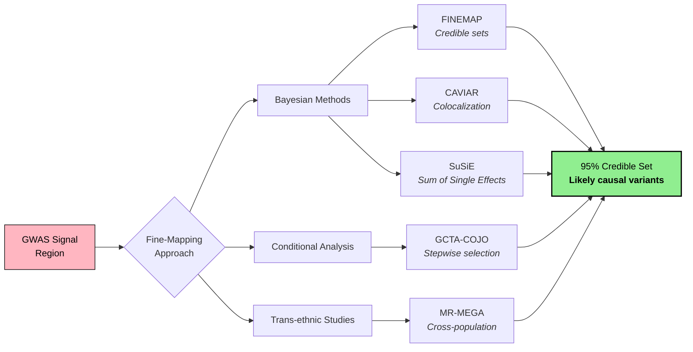
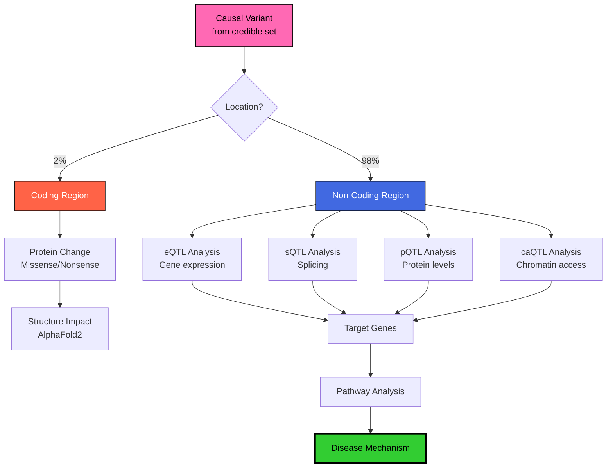
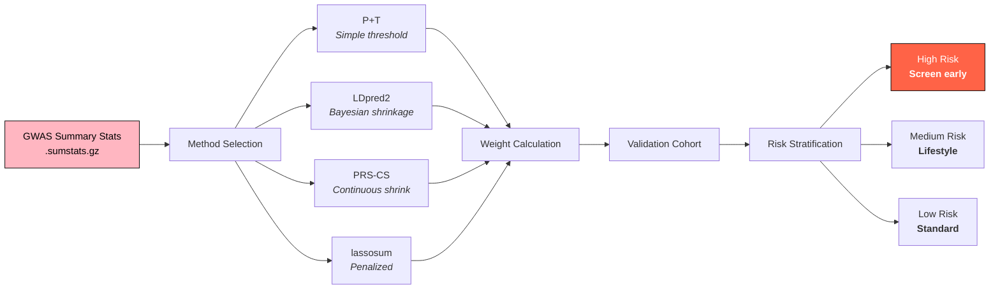
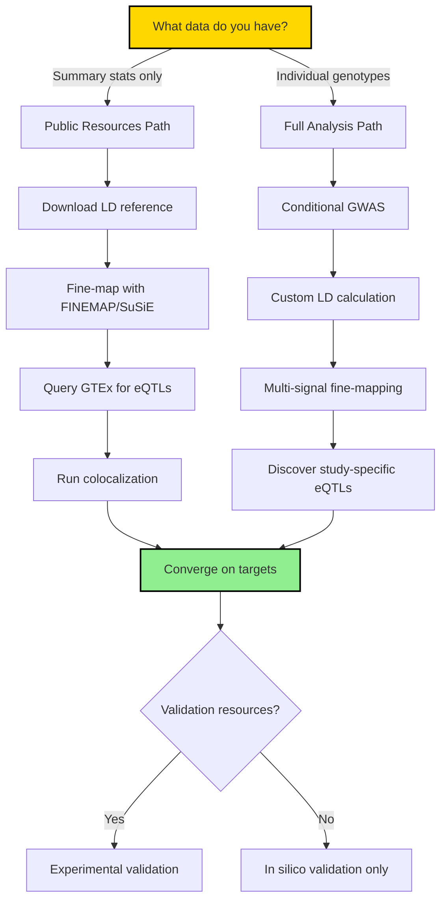

# From Association to Action: The Complete Guide to Post-GWAS Analysis & Fine-Tuning

> **TL;DR**: GWAS finds the neighborhoods where disease genes live. Post-GWAS analysis finds the actual culprits, understands how they cause trouble, and turns that knowledge into medical breakthroughs. This is your roadmap from statistical signals to biological mechanisms—with the math made simple and the pitfalls marked! 🧬🔍

---

## Table of Contents
- [Introduction: After the Manhunt](#introduction-after-the-manhunt)
- [The Post-GWAS Journey: From Signal to Solution](#the-post-gwas-journey-from-signal-to-solution)
- [Stage 1: Fine-Mapping - Finding the Real Culprit](#stage-1-fine-mapping---finding-the-real-culprit)
- [Stage 2: Functional Annotation - Understanding the Crime](#stage-2-functional-annotation---understanding-the-crime)
- [Stage 3: Biological Validation - Building the Case](#stage-3-biological-validation---building-the-case)
- [Stage 4: Clinical Translation - From Lab to Life](#stage-4-clinical-translation---from-lab-to-life)
- [Critical Pitfalls & How to Avoid Them](#critical-pitfalls--how-to-avoid-them)
- [Decision Trees & Workflows](#decision-trees--workflows)
- [Quick Reference Guide](#quick-reference-guide)
- [Methods Reporting Checklist](#methods-reporting-checklist)
- [Conclusion](#conclusion)

---

## Introduction: After the Manhunt

Imagine you're a detective. A GWAS (Genome-Wide Association Study) is like getting a tip that the suspect lives somewhere in a particular neighborhood. That's incredibly valuable—you've narrowed it down from the entire city! But you still don't know:
- Which house they're in (the causal variant)
- What they look like (the molecular mechanism)
- How they committed the crime (the biological pathway)
- How to stop them (the therapeutic target)

**That's where post-GWAS analysis comes in.** It's the meticulous detective work that transforms a statistical association into actionable biological insight.

### Why GWAS Results Are Just the Beginning

A typical GWAS might tell you: *"Variant rs12345678 on chromosome 7 is associated with Type 2 Diabetes (p = 5×10⁻⁹)"*

But what you really need to know is:
- **Which gene** is actually affected?
- **What does the variant DO** to that gene?
- **How does that change** lead to disease?
- **Can we fix it** with a drug?

### First Principles: Why Post-GWAS Exists

At its core, post-GWAS exists because:
1. **True causes are rare and functional** - Among hundreds of linked variants, typically only 1-3 are causal
2. **Linkage creates shadows** - LD means innocent bystanders (r² > 0.8) travel with the guilty party
3. **Context matters** - A variant's effect can change across tissues, times, and environments
4. **Biology requires mechanism** - Statistical association ≠ biological understanding

---

## The Post-GWAS Journey: From Signal to Solution

Let's map out the complete journey from GWAS hits to clinical applications:

```mermaid
graph TD
    A[GWAS Results<br><strong>Manhattan Plot Peak</strong><br><em>Statistical Association</em>] -->|Why here?| B[Fine-Mapping<br><strong>Statistical Refinement</strong><br><em>Narrows to causal variants</em>]
    
    B -->|What's affected?| C[Functional Annotation<br><strong>Multi-Omics Integration</strong><br><em>Links variants to genes/pathways</em>]
    
    C -->|How does it work?| D[Experimental Validation<br><strong>Lab Experiments</strong><br><em>Proves causality</em>]
    
    D -->|Can we use this?| E[Clinical Translation<br><strong>Applications</strong>]
    
    E --> F[🎯 Drug Targets<br><em>New therapies</em>]
    E --> G[📊 Risk Scores<br><em>PRS for prediction</em>]
    E --> H[🔬 Biomarkers<br><em>Disease monitoring</em>]
    
    %% Files at each stage
    A -.->|.sumstats.gz| B
    B -.->|.cred/.vcf| C
    C -.->|.bed/.gtf| D
    D -.->|validated targets| E
    
    style A fill:#FF6B6B,stroke:#000,stroke-width:2px,color:#000
    style B fill:#FFA500,stroke:#000,stroke-width:2px,color:#000
    style C fill:#FFD700,stroke:#000,stroke-width:2px,color:#000
    style D fill:#90EE90,stroke:#000,stroke-width:2px,color:#000
    style E fill:#4169E1,stroke:#000,stroke-width:3px,color:#fff
```



---

## Stage 1: Fine-Mapping - Finding the Real Culprit

### The Linkage Disequilibrium Problem

Here's the challenge: Genetic variants travel in groups, like friends who always hang out together. This phenomenon is called **Linkage Disequilibrium (LD)**. When GWAS finds an association, it's actually detecting a whole group of variants that travel together—but typically only ONE is the actual troublemaker.

**The Math Made Simple:**
- **LD (r²)**: Correlation between variants (0 = independent, 1 = perfect twins)
- **Rule of thumb**: Variants with r² > 0.8 are "best friends" that travel together
- **Challenge**: A typical locus has 50-500 variants in high LD

### Statistical Fine-Mapping Methods



### Key Concepts Simplified

**Posterior Probability (The Core Math)**:
```
Posterior ∝ Likelihood × Prior
         ∝ (How well data fits) × (Biological plausibility)
```
Think of it as updating your bet after seeing the cards!

**Credible Sets**: Instead of saying "it's definitely this variant," we say "we're 95% sure it's one of these 5 variants." 

**Practical Example**:
- Start: 200 variants in LD block
- After fine-mapping: 5-variant credible set
- Reduction: 97.5% fewer candidates to test!

### Functional Fine-Mapping

Statistical evidence alone isn't enough. We need biological plausibility:

| Evidence Type | What We Look For | Tools | Impact on PIP |
|--------------|------------------|-------|---------------|
| **eQTL Integration** | Does variant affect gene expression? | GTEx, eQTLGen | 2-5x increase |
| **Chromatin State** | Is it in active regulatory regions? | ENCODE, Roadmap | 1.5-3x increase |
| **Conservation** | Important across species? | PhyloP, GERP++ | 1.2-2x increase |
| **3D Chromatin** | Contacts gene promoters? | Hi-C, Capture-C | 2-4x increase |
| **Allele-Specific** | Different activity by allele? | ATAC-seq, ChIP-seq | 3-10x increase |

---

## Stage 2: Functional Annotation - Understanding the Crime

Once we've identified likely causal variants, we need to understand their mechanisms. This is where we transform statistical associations into biological stories.

### The Multi-Omics Integration Pipeline



### The Power of QTL Mapping

**QTLs (Quantitative Trait Loci)** are the Rosetta Stone of post-GWAS analysis:

| QTL Type | What It Tells Us | Biological Impact | File Format |
|----------|-----------------|-------------------|-------------|
| **eQTL** | Variant → Gene expression | Changes protein amount | .nominal.txt.gz |
| **sQTL** | Variant → Splicing | Creates protein variants | .permuted.txt.gz |
| **pQTL** | Variant → Protein levels | Direct protein effects | .pqtl.tsv |
| **mQTL** | Variant → Methylation | Epigenetic regulation | .mqtl.bed |
| **caQTL** | Variant → Chromatin | Opens/closes regions | .narrowPeak |

### Colocalization: The Smoking Gun

**The Core Question**: Is the GWAS signal and the molecular QTL signal driven by the SAME causal variant?

**The Math (Simplified)**:
```
PP.H4 = P(same causal variant for both traits)
PP.H3 = P(different causal variants)

If PP.H4 > 0.8 → Strong evidence for shared causality
```

**Methods & When to Use**:
- **coloc**: Bayesian, handles one causal variant per trait
- **fastENLOC**: Multiple causal variants allowed
- **SMR/HEIDI**: Tests pleiotropy vs. linkage
- **TWAS/PrediXcan**: Gene-based association using expression

---

## Stage 3: Biological Validation - Building the Case

Statistical and computational evidence is compelling, but biology demands experimental proof. This is where we move from correlation to causation.

### The Validation Hierarchy

```mermaid
graph TD
    A[In Silico<br><em>Computational</em>] -->|Confidence: 40%| B[In Vitro<br><em>Cell culture</em>]
    B -->|Confidence: 60%| C[Ex Vivo<br><em>Patient samples</em>]
    C -->|Confidence: 80%| D[In Vivo<br><em>Animal models</em>]
    D -->|Confidence: 95%| E[Clinical<br><em>Human studies</em>]
    
    F[Modern Techniques] --> G[CRISPR Screens<br><em>Systematic KO</em>]
    F --> H[MPRA<br><em>Parallel testing</em>]
    F --> I[Base Editing<br><em>Precise changes</em>]
    
    G --> J[🎯 Validated Target]
    H --> J
    I --> J
    
    style A fill:#FFE4B5,stroke:#000,color:#000
    style E fill:#4169E1,stroke:#000,color:#fff
    style J fill:#32CD32,stroke:#000,stroke-width:3px,color:#000
```



### Modern Validation Techniques

**1. CRISPR-Based Validation**
- **CRISPRi/a**: Dial gene expression up/down
- **Prime Editing**: Make exact variant changes
- **Base Editing**: Single nucleotide precision (A→G, C→T)
- **Typical timeline**: 2-3 months per variant

**2. Massively Parallel Reporter Assays (MPRA)**
- Test 10,000+ variants simultaneously
- Measure regulatory activity per allele
- Output: Functional vs. neutral classification
- **Key metric**: Allelic skew > 1.5-fold = functional

**3. Single-Cell Validation**
- **scRNA-seq + Perturb-seq**: Which cell types affected?
- **CROP-seq**: CRISPR + single-cell readout
- **Resolution**: Cell-type-specific mechanisms

---

## Stage 4: Clinical Translation - From Lab to Life

This is where post-GWAS analysis pays off: turning genetic insights into medical applications.

### Building Polygenic Risk Scores (PRS)



### The Math Made Simple

PRS is like a credit score for disease risk:

```
PRS = Σ(effect_size × allele_count)
    = Σ(βᵢ × Gᵢ)

Where:
- βᵢ = how much variant i affects risk
- Gᵢ = your genotype (0, 1, or 2 copies)
```

### Drug Target Prioritization

| Evidence Level | What We Check | Impact on Success | Tools |
|----------------|--------------|-------------------|-------|
| **Genetic Support** | Causal variant exists? | 2x higher success | Open Targets |
| **Direction Clear** | Up or down regulation? | Guides drug type | MR analysis |
| **Safety Signals** | Side effects predicted? | Avoid failures | PheWAS |
| **Druggability** | Can we target it? | Technical feasibility | ChEMBL |
| **Expression** | Where expressed? | On/off-target | GTEx |

### Mendelian Randomization: Nature's Clinical Trial

**The Logic**:
```
If: Genetic Variant → Biomarker → Disease
Then: Changing biomarker WILL change disease risk
Therefore: Biomarker is a valid drug target
```

**Key Assumptions to Check**:
1. Relevance: Strong variant-exposure association
2. Independence: No confounders
3. Exclusion: Only affects outcome through exposure

---

## Critical Pitfalls & How to Avoid Them

### The Top 10 Post-GWAS Mistakes

| Pitfall | Consequence | Solution |
|---------|------------|----------|
| **LD Mismatch** | Wrong credible sets | Match ancestry between GWAS & reference |
| **Winner's Curse** | Inflated effects | Use replication cohort |
| **Single Signal Assumption** | Miss secondary signals | Run conditional analysis first |
| **Nearest Gene Fallacy** | Wrong target (70% error rate) | Use eQTL/Hi-C evidence |
| **Wrong Tissue** | Diluted signals | Match tissue to disease |
| **TWAS ≠ Causality** | False positives | Combine with colocalization |
| **Ignoring Pleiotropy** | Confounded MR | Use MR-Egger/weighted median |
| **P-value Worship** | Miss biology | Consider effect sizes |
| **EUR-only Analysis** | Limited fine-mapping | Include diverse populations |
| **No Replication** | False discoveries | Always validate externally |

### Sanity Checks at Each Stage

```markdown
□ Pre-Fine-Mapping
  ├─ □ Check genomic inflation (λ < 1.1?)
  ├─ □ QQ plot looks reasonable?
  └─ □ LD reference matches GWAS ancestry?

□ Post-Fine-Mapping  
  ├─ □ Credible set size reasonable (< 10 variants)?
  ├─ □ PIP sum ≈ number of causal variants?
  └─ □ Functional enrichment present?

□ Before Validation
  ├─ □ Multiple lines of evidence converge?
  ├─ □ Mechanism biologically plausible?
  └─ □ Effect size worth pursuing?
```

---

## Decision Trees & Workflows

### Choose Your Analysis Path



### Computational Requirements

| Analysis Stage | RAM Needed | Time Estimate | Parallelizable? |
|---------------|------------|---------------|-----------------|
| Fine-mapping (per locus) | 4-8 GB | 5-30 min | Yes (by locus) |
| Colocalization | 2-4 GB | 1-5 min | Yes (by gene) |
| PRS calculation | 16-32 GB | 1-2 hours | Partially |
| TWAS | 8-16 GB | 2-4 hours | Yes (by tissue) |

---

## Quick Reference Guide

### 🎯 Post-GWAS Analysis Checklist

```markdown
□ Fine-Mapping
  ├─ □ Statistical fine-mapping (credible sets)
  ├─ □ Functional annotation integration  
  ├─ □ Multi-ancestry analysis (if available)
  └─ □ Check for multiple signals

□ Functional Characterization
  ├─ □ QTL colocalization (eQTL priority)
  ├─ □ Chromatin state annotation
  ├─ □ Conservation analysis
  ├─ □ 3D chromatin interactions
  └─ □ Allele-specific activity

□ Target Gene Identification  
  ├─ □ NOT just nearest gene
  ├─ □ eQTL evidence (PP.H4 > 0.8)
  ├─ □ Chromatin looping data
  ├─ □ Biological plausibility
  └─ □ Cross-tissue consistency

□ Experimental Validation
  ├─ □ CRISPR validation plan
  ├─ □ MPRA for regulatory variants
  ├─ □ Relevant cell type/tissue
  └─ □ Replication cohort

□ Clinical Translation
  ├─ □ PRS development & validation
  ├─ □ Drug target assessment
  ├─ □ Safety signal check (PheWAS)
  └─ □ Biomarker potential
```

### 📊 Essential Tools & When to Use Them

| Task | Best Tools | Alternatives | Key Files |
|------|------------|--------------|-----------|
| **Fine-Mapping** | SuSiE (multiple causal) | FINEMAP, CAVIAR | .z, .ld, .cred |
| **Colocalization** | coloc (simple) | fastENLOC, eCaviar | .eqtl, .gwas |
| **Annotation** | VEP (comprehensive) | ANNOVAR, SnpEff | .vcf, .vep |
| **PRS** | PRS-CS (accurate) | LDpred2, PRSice-2 | .weights, .score |
| **MR** | TwoSampleMR (R package) | MR-Base, SMR | .exposure, .outcome |
| **Visualization** | LocusZoom (publication) | ggplot2, Gviz | .pdf, .png |

### 🔄 File Format Pipeline

```
Input Files:
├── GWAS: .sumstats.gz → .ma (GCTA format)
├── Genotypes: .bed/.bim/.fam → .pgen/.pvar/.psam
└── Reference: .vcf.gz → .bcf (indexed)

Processing:
├── Fine-Map: .z → .cred → .snp → .config
├── QTL: .nominal.txt.gz → .permuted.txt.gz → .coloc.res
└── Annotation: .vcf → .vep.txt → .annotated.tsv

Output Files:
├── Targets: .prioritized_genes.csv
├── PRS: .weights → .profile → .score
└── Validation: .mpra_results.tsv
```

---

## Methods Reporting Checklist

### Essential Information to Report

```markdown
□ GWAS Details
  ├─ □ Sample size (cases/controls or N)
  ├─ □ Ancestry composition
  ├─ □ Phenotype definition & QC
  ├─ □ Covariates adjusted for
  ├─ □ Software & version (e.g., PLINK 2.0)
  ├─ □ Genomic control λ
  └─ □ Number of variants tested

□ Fine-Mapping
  ├─ □ Method & version (e.g., SuSiE v0.11)
  ├─ □ LD reference panel (population, N)
  ├─ □ Credible set threshold (e.g., 95%)
  ├─ □ Prior on number of causal variants
  └─ □ Functional priors used (if any)

□ QTL Integration  
  ├─ □ QTL dataset (GTEx v8, tissue, N)
  ├─ □ Colocalization method & parameters
  ├─ □ PP.H4 threshold for significance
  └─ □ Multiple testing correction

□ Validation
  ├─ □ Replication cohort details
  ├─ □ Experimental methods
  ├─ □ Cell types/tissues tested
  └─ □ Statistical tests used

□ Data Availability
  ├─ □ Summary statistics location
  ├─ □ Code repository (GitHub/Zenodo)
  ├─ □ Software versions (requirements.txt)
  └─ □ Random seeds for reproducibility
```

---

## Conclusion: The Art of Genetic Detective Work

Post-GWAS analysis transforms statistical associations into biological understanding and clinical applications. It's the bridge between "this variant is associated with disease" and "here's a new drug target that could save lives."

The journey from GWAS peak to therapeutic target is complex but logical:

1. **Narrow down** to causal variants (fine-mapping)
2. **Understand** the molecular consequences (functional annotation)
3. **Prove** the mechanism (experimental validation)
4. **Apply** the knowledge (clinical translation)

### Key Takeaways

- **Never trust the lead SNP** - It's usually just a passenger
- **The nearest gene is usually wrong** - Use functional evidence
- **Diversity improves resolution** - Multi-ancestry is essential
- **Validation is mandatory** - Computation suggests, experiments prove
- **Context is everything** - Right tissue, right time, right environment

### The Future is Integrated

Modern post-GWAS increasingly combines:
- **Machine learning** for pattern recognition
- **Single-cell resolution** for cell-type specificity  
- **Spatial genomics** for tissue architecture
- **Long-read sequencing** for structural variants
- **Population-scale biobanks** for validation

Remember: Every GWAS hit is a mystery waiting to be solved. Post-GWAS analysis gives you the tools to be the detective. Master these methods, avoid the pitfalls, and you're not just analyzing data—you're uncovering the mechanisms of human disease and pointing the way to new treatments.

Now go forth and decode the genome! 🔬🧬

---

### 📚 Essential Resources

- [GWAS Catalog](https://www.ebi.ac.uk/gwas/) - Database of all published GWAS
- [GTEx Portal](https://gtexportal.org/) - Gene expression across tissues
- [Open Targets Platform](https://platform.opentargets.org/) - Drug target validation
- [PGS Catalog](https://www.pgscatalog.org/) - Polygenic score repository
- [MR-Base](https://www.mrbase.org/) - Mendelian randomization platform
- [FINEMAP](http://www.christianbenner.com/) - Bayesian fine-mapping
- [SuSiE](https://stephenslab.github.io/susieR/) - Sum of Single Effects
- [NHGRI Resources](https://www.genome.gov/gwas/) - Tutorials and best practices
